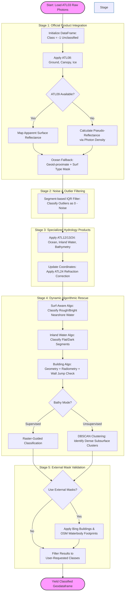

```mermaid
graph TD
    %% Start and Data Load
    Start([Start: Load ATL03 Raw Photons]) --> InitDF[Initialize DataFrame: <br/>Class = -1 Unclassified]
    
    %% Official Product Mapping
    subgraph "Stage 1: Official Product Integration"
        InitDF --> ATL08[Apply ATL08: <br/>Ground, Canopy, Ice]
        ATL08 --> ATL09{ATL09 Available?}
        ATL09 -- Yes --> MapRef[Map Apparent Surface Reflectance]
        ATL09 -- No --> PseudoRef[Calculate Pseudo-Reflectance <br/>via Photon Density]
        MapRef --> OceanFall[Ocean Fallback: <br/>Geoid-proximate + Surf Type Mask]
        PseudoRef --> OceanFall
    end

    %% Noise Cleaning
    subgraph "Stage 2: Noise & Outlier Filtering"
        OceanFall --> IQR[Segment-based IQR Filter: <br/>Classify Outliers as 0 - Noise]
    end

    %% Specialized Bathy/Water Products
    subgraph "Stage 3: Specialized Hydrology Products"
        IQR --> ATLXX[Apply ATL12/13/24: <br/>Ocean, Inland Water, Bathymetry]
        ATLXX --> CoordUpdate[Update Coordinates: <br/>Apply ATL24 Refraction Correction]
    end

    %% Dynamic Algorithmic Rescue
    subgraph "Stage 4: Dynamic Algorithmic Rescue"
        CoordUpdate --> SurfAlgo[Surf-Aware Algo: <br/>Classify Rough/Bright Nearshore Water]
        SurfAlgo --> InlandAlgo[Inland Water Algo: <br/>Classify Flat/Dark Segments]
        InlandAlgo --> BldgAlgo[Building Algo: <br/>Geometry + Radiometry + Wall Jump Check]
        BldgAlgo --> BathyAlgo{Bathy Mode?}
        BathyAlgo -- Supervised --> RasterMatch[Raster-Guided Classification]
        BathyAlgo -- Unsupervised --> DBSCAN[DBSCAN Clustering: <br/>Identify Dense Subsurface Clusters]
    end

    %% Final Validation
    subgraph "Stage 5: External Mask Validation"
        RasterMatch --> ExtMasks{Use External Masks?}
        DBSCAN --> ExtMasks
        ExtMasks -- Yes --> BingOSM[Apply Bing Buildings & <br/>OSM Waterbody Footprints]
        ExtMasks -- No --> FinalFilter
        BingOSM --> FinalFilter[Filter Results to <br/>User-Requested Classes]
    end

    FinalFilter --> End([Yield Classified Geodataframe])

    %% Styling
    style Start fill:#f9f,stroke:#333,stroke-width:2px
    style End fill:#f9f,stroke:#333,stroke-width:2px
    style Stage 4 fill:#e1f5fe,stroke:#01579b
```